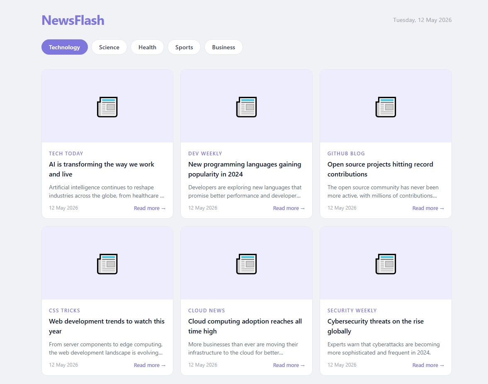

# Day 21 — News Headlines

A news headlines app with category filter and fallback content.

## Preview

## Features
- 5 news categories — Technology, Science, Health, Sports, Business
- News cards with image, source, title, description and date
- Fallback news content when API is unavailable
- Click any card to read the full article
- Responsive grid layout
- Live date display

## Tech Stack
- HTML5
- CSS3 (Grid, line-clamp, transitions)
- JavaScript (fetch, async/await, DOM)

## What I Learned
- Using CSS line-clamp to truncate text
- Building a fallback data system
- Handling image load errors with onerror
- Dynamic category switching

## Part of
[30 Days 30 Projects](https://github.com/anmisha-dash/30-days-30-projects) challenge